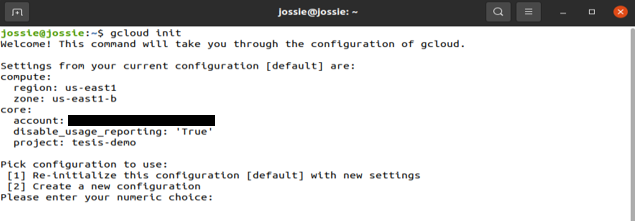
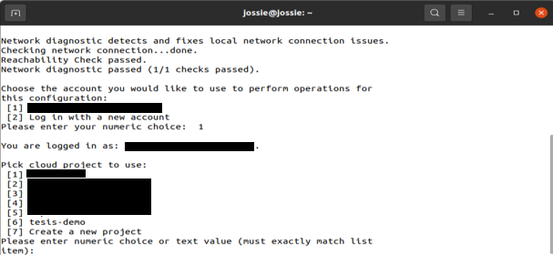
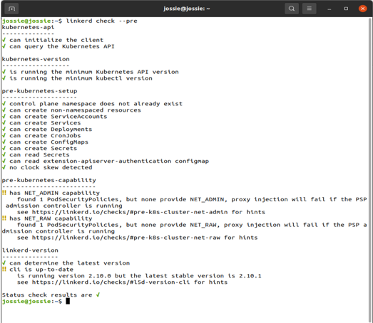
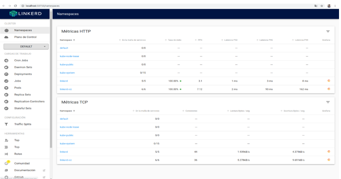
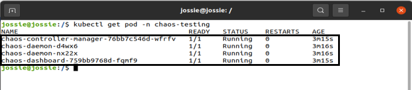
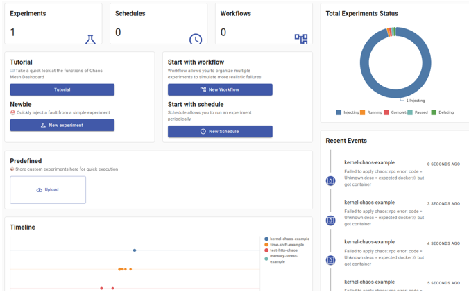

# Experimentos De Tesis
La guia muestra como implementar Chaos Engineering en entornos Cloud Native de forma sencilla dentro de entornos Linux como sistema huesped para trabajar.

### **Herramientas necesarias**
- [Google Cloud Platform](https://cloud.google.com/sdk/docs/install-sdk)
- [Kubernetes](https://kubernetes.io/es/)
- [Linkerd](https://chaos-mesh.org/)
- [Chaos Mesh](https://chaos-mesh.org/)
  

## Configuración de entorno

### Instalación y configuracion de Google Cloud en entorno

1. Agregar el sdk de Google cloud como un recurso de paquetes dentro del sistema.
   
   ```
   echo "deb [signed-by=/usr/share/keyrings/cloud.google.gpg] http://packages.cloud.google.com/apt cloud-sdk main" | sudo tee -a /etc/apt/sources.list.d/google-cloud-sdk.list
   ```

2. Importar la llave publica de Google Cloud dentro del entorno.
   
   ```
   curl https://packages.cloud.google.com/apt/doc/apt-key.gpg | sudo apt-key --keyring /usr/share/keyrings/cloud.google.gpg add -
   ```

3. Actualizar la lista de paquetes e instalar Cloud SDK, tomar en cuenta que esta instalacion puede tardar varios minutos.
   
   ```
   sudo apt-get update && sudo apt-get install google-cloud-sdk
   ```
4. Inicializar el SDK, luego de algunos segundos pedirá iniciar sesión con una cuenta para lo cual se debe presionar "Y" y se abrira una ventana en el navegador para ingresar con la cuenta deseada.
   
   ```
   gcloud init
   ```
    -  Al inicializar se mostrara un grupo de opciones similar a la siguiente. 
  
    

    - Se abrira una ventana en el navegador en caso aplique donde pedira seleccionar una cuenta con la cual continuar.
  
    

     - Permitimos el acceso y se mostrara una ventana en la cual confirma que hemos podido acceder, para lo cual podemos regresar a la terminal.
  
    

5. Al regresar a la terminal solicita seleccionar un proyecto existente en nuestra cuenta de Google Cloud, el cual se debe seleccionar ingresando su respectivo numero.
   
    

6. Seleccionamos la opcion para configurar una region y zona por default para trabajar y presionar "Y".


### Implementación de cluster de Kubernetes

7.  Instalar el cliente de Kubernetes.
   
    ```
    sudo apt-get install kubectl
    ```

8. Verificar que la instalacion haya sido correcta.
   
    ```
    kubectl version --short
    ```

9. Crear un clúster para el despliegue de la arquitectura.

    ```
    gcloud container clusters create tesisdemo --num-nodes=2 --tags=allin,allout --enable-legacy-authorization --issue-client-certificate --machine-type=n1-standard-2 --no-enable-network-policy
    ```

    Banderas utilizadas:

    - create [nombre_del_cluster]
    - **--num-nodes=2**: Esta bandera sirve para definir la cantidad de nodos que tendrá el cluster, en este caso es generaron únicamente 2.
    - **--tags=allin,allout**: Se indican tags referentes a reglas de firewall con la apertura de puertos, en este caso se permitió todo el tráfico de entrada o salida (considerar que esto se realizo debido a que es un ambiente de ejemplo).
    - **--enable-legacy-authorization**: Esta política de kubernetes otorga permisos definidos a todos los usuarios del cluster.
    - **--machine-type=n1-standard-2**: Esta etiqueta sirve para definir el tipo de hardware que se utilizara, el tipo n1 standard 2 es de uso general el cual posee 2 nucleos, 7.50Gb de memoria RAM, un máximo de 128 discos persistentes, un almacenamiento local de 257TB en SSD y un ancho de banda de 10Gbps.

10. Al finalizar la creacion debemos obtener las credenciales para el manejo del clúster.

    ```
    gcloud container clusters get-credentials tesisdemo --zone us-central1-c --project tesis-demo
    ```

### Instalacion de Linkerd

11. Instalar la linea de comandos de Linkerd.

    ```
    curl -sL run.linkerd.io/install | sh
    ```

12. Verificar la instalacion.

    ```
    linkerd version
    ```

13. Validar que el clúster de Kubernetes creado cumple con lo necesario para Linerd.
    
    ```
    linkerd check --pre
    ```

14. Si todas las verificaciones son aprobadas se mostrara un status correcto al final.

    
15. Instalar el Control Plane dentro del clúster, esto genera la observabilidad para el mismo. Tener en cuenta que esta instalación puede tardar varios minutos. 
    
    ```
    linkerd install | kubectl apply -f -
    ```

16. Validamos nuevamente la instalacion.
    
    ```
    linkerd check
    ```

17. Agregamos la extensión para visualizar el estado de la arqutiectura desde el dashboard de Linerd.
    
    ```
    linkerd viz install | kubectl apply -f -
    ```

18. Al tener una arquitectura en ejecucion podemos habilitar el dashboard cuando sea necesario para el monitoreo, esto abrira una ventana en el navegador con el dashboard.
    ```
    linkerd viz dashboard
    ```

    


### Instalacion de Chaos mesh

19. Instalar Chaos Mesh.
    
    ```
    curl -sSL https://mirrors.chaos-mesh.org/v2.2.0/install.sh | bash
    ```

20. Verificar la instalación, donde se podran visualizar los pods creados para Chaos Mesh.
    
    ```
    kubectl get pod -n chaos-testing
    ```

    

21. Instalacion de dashboard web.
    
    ```
    sudo apt install helm --classic

    sudo helm install chaos-mesh chaos-mesh/chaos-mesh --namespace=chaos-testint --version v0.4.4 --set dashboard.create=true
    ```

22. Al haber instalado el dashboard se puede desplegar de la siguiente forma.
    ```
    kubectl port-forward -n chaos-testing svc/chaos-dashboard 2333:2333
    ```

    Esto abrira una ventana en el navegador con el dashboard de Chaos Mesh, en el cual se puede ver los experimentos activos, estadisticas sobre los mismos e informacion de experimentos ya ejecutados.

    

### Clonacion de repositorio

23. Se puede clonar el repositorio en el cual se encuentran los archivos para desplegar la arquitectura de ejemplo y los experimentos definidos.

    ```
    git clone https://github.com/jossiebk/ExperimentosTesis.git
    ```


### Vista de contenedores Docker
Los contenedores utilizados para la definicion de la arquitectura en ExperimentosTesis/Arquitectura/Servidor/apache.yaml pueden verificarse en los siguientes enlaces:

> https://hub.docker.com/repository/docker/jossie/apache

> https://hub.docker.com/repository/docker/jossie/client

## Ejecución de experimentos


### Desplegar arquitectura

24. Ingresar a la carpeta ExperimentosTesis/Arquitectura/Servidor/ y ejecutar el despliegue.
    
    ```
    kubectl apply -f apache.yaml
    ```

### Ejecutar los experimentos deseados

25. Ingresar a la carpeta ExperimentosTesis/Experimentos/ y ejecutar el experimento deseado.

    ```
    kubectl apply -f [nombre_de_archivo.yaml]
    ```

    Para detener cada experimento se puede realizar mediante 

    ```
    kubectl delete -f [nombre_de_archivo.yaml]
    ```

### Referencias
> https://linkerd.io/

> https://chaos-mesh.org/